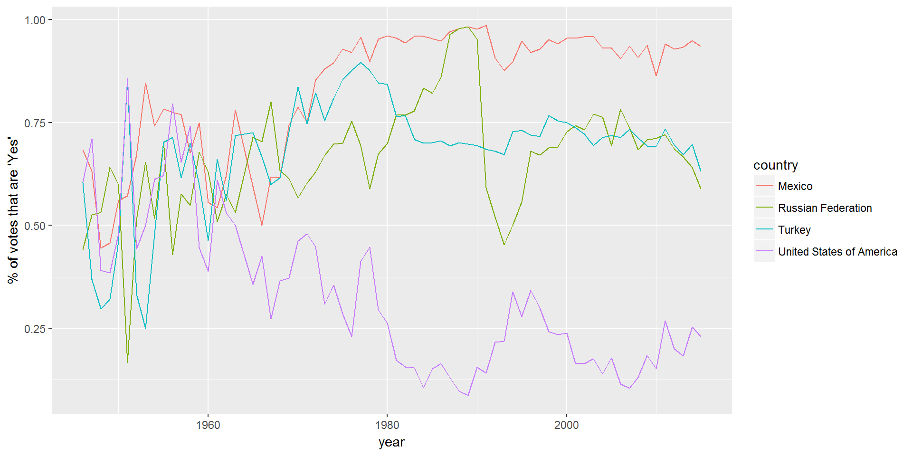
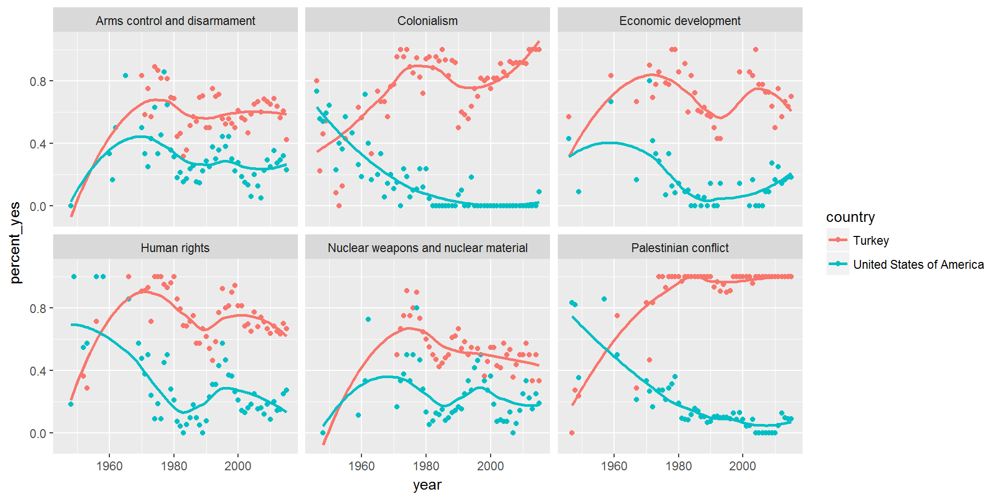

Let's take a look at the voting history of countries in the United Nations General Assembly. We will be using data from the unvotes package. Additionally, we will make use of the tidyverse and lubridate packages.


```r
library(unvotes)
library(tidyverse)
library(lubridate)
library(DT)
```

## Data

We have three datasets we can work with: `un_roll_calls`, `un_roll_call_issues`, and `un_votes`. Each of these datasets contains a variable called `rcid`, the roll call id, which can be used to join them with each other.

- The `un_votes` dataset provides information on the voting history of the United Nations General Assembly. It contains one row for each country-vote pair.


```r
un_votes
```

```
## # A tibble: 738,764 x 4
##     rcid country                  country_code vote 
##    <int> <chr>                    <chr>        <fct>
##  1     3 United States of America US           yes  
##  2     3 Canada                   CA           no   
##  3     3 Cuba                     CU           yes  
##  4     3 Haiti                    HT           yes  
##  5     3 Dominican Republic       DO           yes  
##  6     3 Mexico                   MX           yes  
##  7     3 Guatemala                GT           yes  
##  8     3 Honduras                 HN           yes  
##  9     3 El Salvador              SV           yes  
## 10     3 Nicaragua                NI           yes  
## # ... with 738,754 more rows
```

- The `un_roll_calls` dataset contains information on each roll call vote of the United Nations General Assembly.


```r
un_roll_calls
```

```
## # A tibble: 5,429 x 9
##     rcid session importantvote date       unres   amend  para short  descr
##    <int>   <dbl>         <dbl> <date>     <chr>   <dbl> <dbl> <chr>  <chr>
##  1     3       1             0 1946-01-01 R/1/66      1     0 AMEND~ TO A~
##  2     4       1             0 1946-01-02 R/1/79      0     0 SECUR~ TO A~
##  3     5       1             0 1946-01-04 R/1/98      0     0 VOTIN~ "TO ~
##  4     6       1             0 1946-01-04 R/1/107     0     0 DECLA~ TO A~
##  5     7       1             0 1946-01-02 R/1/295     1     0 GENER~ "TO ~
##  6     8       1             0 1946-01-05 R/1/297     1     0 ECOSO~ TO A~
##  7     9       1             0 1946-02-05 R/1/329     0     0 POST-~ TO O~
##  8    10       1             0 1946-02-05 R/1/361     1     1 U.N. ~ "TO ~
##  9    11       1             0 1946-02-05 R/1/376     0     0 TRUST~ TO A~
## 10    12       1             0 1946-02-06 R/1/394     1     1 COUNC~ TO A~
## # ... with 5,419 more rows
```

- The `un_roll_call_issues` dataset contains (topic) classifications of roll call votes of the United Nations General Assembly. Many votes had no topic, and some have more than one.


```r
un_roll_call_issues
```

```
## # A tibble: 5,281 x 3
##     rcid short_name issue               
##    <int> <chr>      <chr>               
##  1  3372 me         Palestinian conflict
##  2  3658 me         Palestinian conflict
##  3  3692 me         Palestinian conflict
##  4  2901 me         Palestinian conflict
##  5  3020 me         Palestinian conflict
##  6  3217 me         Palestinian conflict
##  7  3298 me         Palestinian conflict
##  8  3429 me         Palestinian conflict
##  9  3558 me         Palestinian conflict
## 10  3625 me         Palestinian conflict
## # ... with 5,271 more rows
```

## Analysis

First, let's take a look at how often each country voted "yes" on a resolution in each year. We'll visualize the results, so let's pick a few countries of interest first,


```r
country_list <- c("United States of America", "Russian Federation", "Mexico", "Turkey")
```

and focus our analysis on them.


```r
un_votes %>%
  filter(country %in% country_list) %>%
  inner_join(un_roll_calls, by = "rcid") %>%
  group_by(year = year(date), country) %>%
  summarize(votes = n(),
            percent_yes = mean(vote == "yes")) %>%
  ggplot(mapping = aes(x = year, y = percent_yes, color = country)) +
    geom_line() +
    ylab("% of votes that are 'Yes'")
```



Next, let's see how US and Turkey's voting record changed over the years on each of the issues.


```r
un_votes %>%
  filter(country %in% c("United States of America", "Turkey")) %>%
  inner_join(un_roll_calls, by = "rcid") %>%
  inner_join(un_roll_call_issues, by = "rcid") %>%
  group_by(country, year = year(date), issue) %>%
  summarize(votes = n(),
            percent_yes = mean(vote == "yes")) %>%
  filter(votes > 5) %>%  # Only use records where there are more than 5 votes
  ggplot(mapping = aes(x = year, y = percent_yes, color = country)) +
    geom_point() +
    geom_smooth(method = "loess", se = FALSE) +
    facet_wrap(~ issue)
```



## References

1. David Robinson (2017). unvotes: United Nations General Assembly Voting Data. R package version 0.2.0. https://CRAN.R-project.org/package=unvotes.
2. Erik Voeten "Data and Analyses of Voting in the UN General Assembly" Routledge Handbook of International Organization, edited by Bob Reinalda (published May 27, 2013).
3. Much of the analysis has been modeled on the examples presented in the [unvotes package vignette](https://cran.r-project.org/web/packages/unvotes/vignettes/unvotes.html).

## Appendix

Below is a list of countries in the dataset:


```r
un_votes %>% 
  arrange(country) %>% 
  select(country) %>%
  distinct() %>%
  datatable()
```

preserveab9cb06675d1c06d
