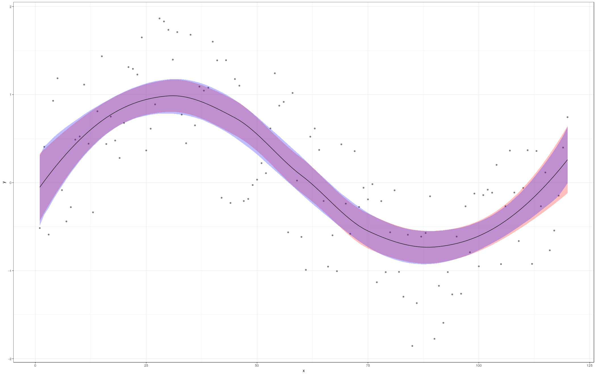

```{r, message=FALSE, warning=FALSE, include=FALSE}
options(
  htmltools.dir.version = FALSE, # for blogdown
  width = 80,
  tibble.width = 80
)

knitr::opts_chunk$set(
  fig.align = "center"
)

htmltools::tagList(rmarkdown::html_dependency_font_awesome())
```

```{r setup, echo=FALSE}
library(dplyr)
library(ggplot2)
library(tidyr)
library(parallel)
library(foreach)
library(doMC)

ggplot2::theme_set(theme_bw())
```


## Parallelization

### `parallel`

Part of the base packages in R 

* tools for the forking of R processes (some functions do not work on Windows)

* Core functions:
    
    * `detectCores` : 컴퓨터의 코어 갯수 측정
    * `pvec`: Parallelization of a vectorized function call
    * `mclapply` : Parallelized version of `lapply`
    * `mcparallel` & `mccollect`


__`detectCores`__

```{r eval=FALSE}
detectCores()

## [1] 24
```

__pvec__
```{r eval=FALSE}
system.time(pvec(1:1e7, sqrt, mc.cores = 1))

##   user  system elapsed 
##  0.214   0.029   0.243 

system.time(pvec(1:1e7, sqrt, mc.cores = 4))

##   user  system elapsed 
##  0.442   0.185   0.631 

system.time(pvec(1:1e7, sqrt, mc.cores = 8))

##   user  system elapsed 
##  0.532   0.389   0.372 
```

```{r eval=FALSE}
cores = c(1,2,4,8,16)
order = 6:8
res = map_dbl(
  cores, 
  function(x) {
     map_dbl(order, function(y) system.time(pvec(1:(10^y), sqrt, mc.cores=x))[3]) 
  }
) %>% do.call(rbind,.)

rownames(res) = paste0(cores," cores")
colnames(res) = paste0("10^",order)

res

##            10^6  10^7  10^8
##  1 cores  0.016 0.282 1.489
##  2 cores  0.070 0.526 5.198
##  4 cores  0.052 0.430 5.023
##  8 cores  0.054 0.376 4.098
##  16 cores 0.073 0.401 4.049
```

__mclapply__

Parallelized version of `lapply`

```{r eval=FALSE}
system.time(rnorm(1e6))

##   user  system elapsed 
##  0.101   0.007   0.107 

system.time(unlist(mclapply(1:10, function(x) rnorm(1e5), mc.cores = 2)))

##   user  system elapsed 
##  0.148   0.136   0.106 

system.time(unlist(mclapply(1:10, function(x) rnorm(1e5), mc.cores = 4)))

##   user  system elapsed 
##  0.242   0.061   0.052
```

```{r eval=FALSE}
system.time(unlist(mclapply(1:10, function(x) rnorm(1e5), mc.cores = 4)))

##   user  system elapsed 
##  0.097   0.047   0.079 

system.time(unlist(mclapply(1:10, function(x) rnorm(1e5), mc.cores = 8)))

##   user  system elapsed 
##  0.193   0.076   0.040 

system.time(unlist(mclapply(1:10, function(x) rnorm(1e5), mc.cores = 10)))

##   user  system elapsed 
##  0.162   0.083   0.041 

system.time(unlist(mclapply(1:10, function(x) rnorm(1e5), mc.cores = 12)))

##   user  system elapsed 
##  0.098   0.065   0.037 
```


__mcparallel__

Asynchronously evaluation of an R expression in a separate process

```{r}
m = mcparallel(rnorm(1e6))
n = mcparallel(rbeta(1e6,1,1))
o = mcparallel(rgamma(1e6,1,1))

str(m)
str(n)
```

__mccollect__

Checks `mcparallel` objects for completion

```{r}
str(mccollect(list(m,n,o)))
```

mccollect - waiting

```{r}
p = mcparallel(mean(rnorm(1e5)))
mccollect(p, wait = FALSE, 10) # will retrieve the result (since it's fast)
mccollect(p, wait = FALSE)     # will signal the job as terminating
mccollect(p, wait = FALSE)     # there is no longer such a job
```

## doMC & foreach

Packages by Revolution Analytics that provides the `foreach` function which is a parallelizable `for` loop (and then some).

* Core functions:
    
    * `registerDoMC`
    * `foreach`, `%dopar%`, `%do%`

__`registerDoMC`__

Primarily used to set the number of cores used by `foreach`, by default uses `options("cores")` or half the number of cores found by `detectCores` from the parallel package.

```{r eval=FALSE}
options("cores")

## $cores
## NULL

detectCores()

## [1] 24

getDoParWorkers()

## [1] 1

registerDoMC(4)
getDoParWorkers()

## [1] 4
```

__`foreach`__

A slightly more powerful version of base `for` loops (think `for` with an `lapply` flavor). Combined with `%do%` or `%dopar%` for single or multicore execution.

```{r}
for(i in 1:10) sqrt(i)

foreach(i = 1:5) %do% 
  sqrt(i)   
```

__`foreach` - iterators__

`foreach` can iterate across more than one value, but it doesn't do length coercion

```{r}
foreach(i = 1:5, j = 1:5) %do% 
  sqrt(i^2+j^2)   
```

```{r}
foreach(i = 1:5, j = 1:2) %do% 
  sqrt(i^2+j^2)   
```

__`foreach` - combining results__

```{r}
foreach(i = 1:5, .combine='c') %do% 
  sqrt(i)   
foreach(i = 1:5, .combine='cbind') %do% 
  sqrt(i)   
foreach(i = 1:5, .combine='+') %do% 
  sqrt(i)   
```

__`foreach` - parallelization__

Swapping out `%do%` for `%dopar%` will use the parallel backend.

```{r}
registerDoMC(4)
```

```{r}
system.time(foreach(i = 1:10) %dopar% mean(rnorm(1e6)))
registerDoMC(8)
system.time(foreach(i = 1:10) %dopar% mean(rnorm(1e6)))
registerDoMC(12)
system.time(foreach(i = 1:10) %dopar% mean(rnorm(1e6)))
```


### Example - Bootstraping

Bootstrapping is a resampling scheme where the original data is repeatedly reconstructed by taking a sample (with replacement) of the same size as the original data, and using that to conduct whatever analysis procedure is of interest. Below is an example of fitting a local regression (`loess`) to some synthetic data, we will construct a bootstrap prediction interval for this model.

```{r}
set.seed(3212016)
d = data.frame(x = 1:120) %>%
    mutate(y = sin(2*pi*x/120) + runif(length(x),-1,1))

l = loess(y ~ x, data=d)
d = d %>% mutate(
  pred_y = predict(l),
  pred_y_se = predict(l,se=TRUE)$se.fit
) %>% mutate(
  pred_low  = pred_y - 1.96 * pred_y_se,
  pred_high = pred_y + 1.96 * pred_y_se
)
```

```{r fig.align="center", fig.width=9, fig.height=6}
ggplot(d, aes(x,y)) +
  geom_point(color="gray50") +
  geom_ribbon(aes(ymin=pred_low, ymax=pred_high), fill="red", alpha=0.25) +
  geom_line(aes(y=pred_y)) +
  theme_bw()
```

We will now re-implement the code below using one of the parallelization techniques we have just discussed and will then check the performance with 1, 2, and 4 cores.


```{r eval=FALSE}
n_rep = 5000
d_xy = select(d, x, y)

res = map(1:n_rep, function(i) {
  d_xy %>% 
    select(x,y) %>% 
    sample_n(nrow(d), replace=TRUE) %>%
    loess(y ~ x, data=.) %>%
    predict(newdata=d) %>%
    setNames(NULL)
}) %>% do.call(cbind, .)

d = d %>% mutate(
  bs_low = apply(res,1,quantile,probs=c(0.025), na.rm=TRUE),
  bs_high  = apply(res,1,quantile,probs=c(0.975), na.rm=TRUE)
)
```

---

```{r eval=FALSE}
ggplot(d, aes(x,y)) +
  geom_point(color="gray50") +
  geom_ribbon(aes(ymin=pred_low, ymax=pred_high), fill="red", alpha=0.25) +
  geom_ribbon(aes(ymin=bs_low, ymax=bs_high), fill="blue", alpha=0.25) +
  geom_line(aes(y=pred_y)) +
  theme_bw()
```

```{r echo=FALSE}

```

## What to use when?

Optimal use of multiple cores is hard, there isn't one best solution

    * Don't underestimate the overhead cost
    * More art than science - experimentation is key
    * Measure it or it didn't happen
    * Be aware of the trade off between developer time and run time

## Acknowledgments

Above materials are derived in part from the following sources:

* Colin Rundel - [Sta 323 - Statistical Computing](https://www2.stat.duke.edu/~cr173/Sta323_Sp18/slides/Lec13_parallel.html#1)
